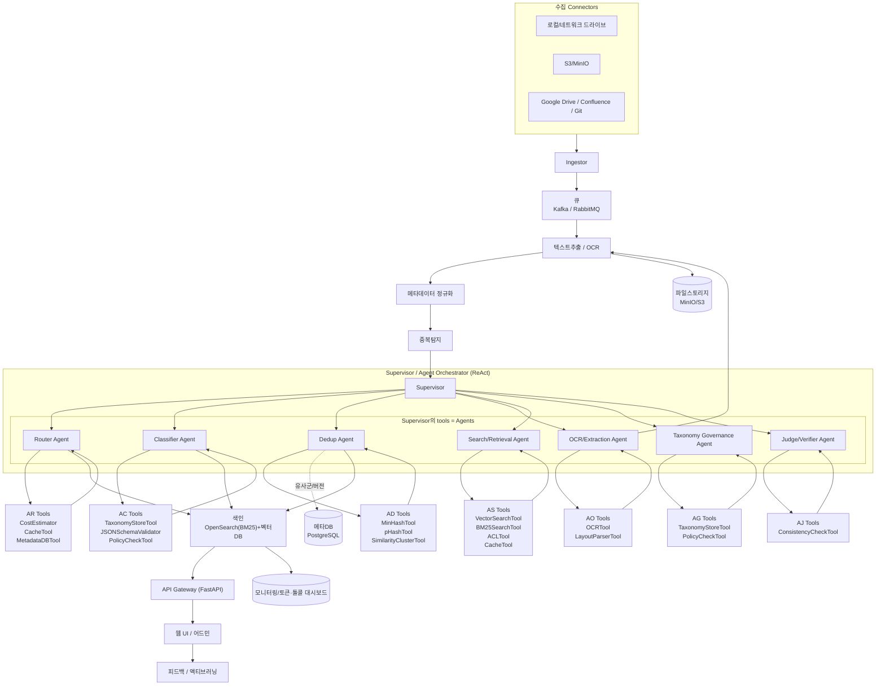
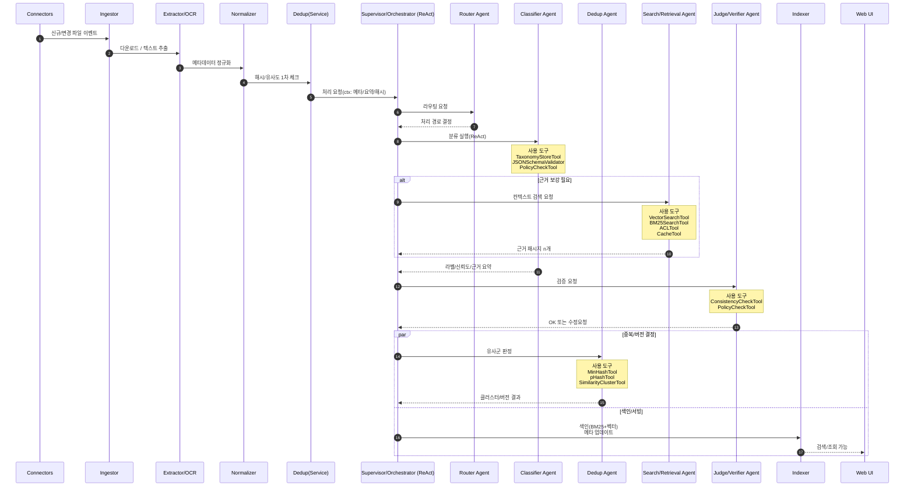
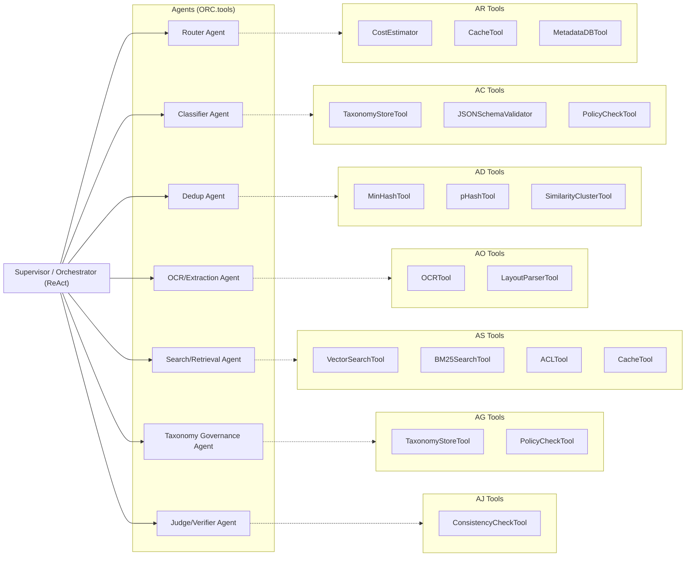

# 문서 분류 솔루션 — 프로젝트 뼈대

> **LLM‑퍼스트 분류(ReAct Multi‑Agent)** · 중복 제거 · 빠른 조회를 위한 실무형 아키텍처와 실행 계획

---

## 1) 목표 & 성공지표

* **핵심 가정**: 분류 알고리즘의 중심은 **LLM(대규모 언어모델)** 이다. 규칙/임베딩은 보조.
* **목표**: LLM을 활용해 문서를 자동 분류하고, 중복을 제거하며, 고품질 검색/조회 제공.
* **핵심 성공지표(KPIs)**

  * 분류 성능: **Macro F1 ≥ 0.88**(상위 계층), **Micro F1 ≥ 0.90**(프로젝트 내부)
  * 응답 지연: **분류 p95 ≤ 2.5s**(배치 제외, 2K 토큰 기준)
  * 비용: **\$ /1K 토큰 목표치** 설정 및 월간 **예산 대비 ±10% 이내**
  * 검색 시간: **평균 60%+ 단축**, 중복률 **70%+ 감소**
  * 사용자 수용도: **Top‑3 검색 만족도 ≥ 80%**

---

## 2) 범위 (MVP → 확장)

* **MVP (1단계)**

  * 파일 수집/텍스트 추출/OCR, 메타 정규화 및 파일 해시
  * 중복 탐지(정확 일치 + MinHash/LSH + pHash)
  * **LLM 분류 파이프라인(LLM‑퍼스트)**: 프롬프트 오케스트레이션, RAG(라벨 정의/예시), **JSON 스키마 강제 출력**
  * 인덱싱(BM25 + 벡터), 검색 API & 간단 UI
  * 관리 콘솔(택소노미/프롬프트 버전/피드백)
* **확장 (2\~3단계)**

  * 계층/다중라벨 LLM 분류 + **Self‑Consistency/Ensemble**
  * **코스트 최적화 라우팅**(작은 LLM → 불확실 시 큰 LLM)
  * 사용자 행동 로그 기반 LTR, 권한 기반 검색(RBAC)
  * **Distillation**: LLM 예측을 소형 모델로 증류해 대량 배치 가속

---

## 3) 아키텍처 (Mermaid)

### 3‑A) 시스템 전반 흐름도



### 3‑B) 처리 시나리오(시퀀스)



### 3‑C) 에이전트 ↔ 도구 매핑



### 3‑1) Agent 토폴로지 & 메모리

* **전역 메모리**: 프로젝트별 택소노미/라벨 정의, 라벨 예시, 정책/금지 규칙, 사용자 피드백
* **에피소드 메모리**: 단일 문서 처리 세션의 툴 호출 이력, 중간 추론(요약만 저장)
* **장기 메모리(옵션)**: 빈번한 패턴/실패 케이스 → 개선 제안 큐

---

## 4) 데이터 흐름 (High‑level)

1. **수집**: 커넥터가 신규/변경 파일을 감지하여 큐에 이벤트 발행.
2. **텍스트화**: MIME 기반 파서(pdfplumber, docx, msg/eml, html), OCR(Tesseract/KR) 수행.
3. **정규화**: 제목/경로/저자/프로젝트ID/날짜/버전 등 메타 스키마 통일.
4. **중복 탐지**: SHA‑256(바이트 동일) + MinHash/LSH(텍스트 유사), 이미지 pHash.
5. **분류**: 규칙(폴더/파일명/패턴) → 제로샷/임베딩 기반 ML → 최종 라벨 앙상블.
6. **색인**: BM25 역색인 + 임베딩 벡터 인덱스(혼합 검색).
7. **조회**: 질의 확장(동의어/프로젝트 키), 필터/패싯, 권한 필터링.
8. **학습루프**: 사용 피드백(승인/수정) → 라벨 데이터 누적 → 주기적 재학습.

---

## 5) 구성요소(서비스)

* **기본 파이프라인**: connectors / ingestor / extractor / normalizer / deduper
* **agent-orchestrator**: ReAct 루프 실행, 대화 상태/툴 결과를 합성하여 다음 행동 결정
* **agent-router**: 문서 특성/메타/간이요약 기반으로 전문 에이전트로 라우팅
* **agents**:

  * **Classifier Agent**: 카테고리 다중라벨 결정, 신뢰도/근거 요약 산출
  * **Dedup Agent**: 후보군 조회, 유사도 계산, 클러스터/버전 결정
  * **OCR/Extraction Agent**: 품질 점검, 레이아웃 분석 및 보정 파라미터 선택
  * **Search/Retrieval Agent**: RAG 컨텍스트 구축, 증거 문장 셀렉션
  * **Taxonomy Governance Agent**: 라벨 변경 제안, 충돌 감지, 영향 분석
  * **Judge/Verifier Agent**: 스키마/정책 위반 검사, 일관성·근거 검토
* **tool-registry**: 모든 도구의 **함수/스키마** 등록·버전·권한 관리
* **rag-store**: 라벨 정의/예시/규칙 벡터 스토어
* **llm-router**: 크기/비용/지연 기반 모델 선택
* **distiller(옵션)**: LLM 예측 증류
* **indexer/search-api/admin-ui/feedback/scheduler/observability**

---

## 6) 기술 스택 제안

* **프레임워크**: **LangGraph/LangChain(ReAct 패턴)**, Pydantic(툴 스키마), FastAPI
* **LLM 서빙**: vLLM/sglang(온프레) 또는 관리형 API
* **상태/메모리**: Redis(에피소드), Postgres(전역), MinIO/S3(아티팩트)
* **임베딩/벡터**: sentence‑transformers, pgvector/Milvus/FAISS
* **문서 파싱/OCR**: pdfplumber, unstructured, Tesseract/PaddleOCR, layoutparser(옵션)
* **검색**: OpenSearch/Elasticsearch(+k‑NN)
* **관측**: Prometheus/Grafana/OTel(+ **툴콜/토큰/에이전트 트레이스**)
* **기타**: Kafka/RabbitMQ, Celery, Airflow/Prefect, Keycloak, Vault, Docker/K8s/ArgoCD

---

## 7) 메타데이터 스키마 (초안)

```yaml
Document:
  id: uuid
  source_path: string
  project_id: string
  title: string
  author: string
  created_at: datetime
  modified_at: datetime
  version: string | null
  mime_type: string
  language: ['ko','en',...]
  checksum_sha256: string
  text_hash_minhash: string
  image_phash: string | null
  size_bytes: int
  tags: string[]
  categories: string[]        # 최종 라벨(다중라벨)
  confidence: float           # 0~1
  pii_flags: string[]         # PII 탐지 항목
  acl: { allow_roles: string[], allow_users: string[] }
```

---

## 8) 중복 제거 설계

* **정확 일치**: 바이트 SHA‑256 동일 → 즉시 중복 처리(심볼릭 링크/마스터 참조)
* **텍스트 유사**: 전처리(소문자/숫자/불용어 제거) → Shingling(5‑gram) → MinHash → **LSH**로 후보 탐색 → Jaccard ≥ T로 군집.
* **이미지/스캔**: perceptual hash(pHash/dHash)로 근사 매칭.
* **버전 관리**: 동일 문서군 내 최신본 승격, 이전본은 shadow version 보존.

---

## 9) 분류(ReAct Agent)

1. **Router Agent**: 문서 메타/샘플 텍스트로 경로 선택(예: 일반/계약/재무/스캔)
2. **Classifier Agent(ReAct)**:

   * Step‑by‑step 추론 → `VectorSearchTool`로 라벨 정의/예시 조회
   * 필요 시 `BM25SearchTool`로 원문 근거 구절 수집
   * 임계치 미달 시 `Ask‑Judge` 또는 상위 모델로 **Escalate**
   * `JSONSchemaValidator`로 구조화 출력 보증
3. **Judge/Verifier**: 택소노미 규칙/정책 위반 검사, 근거‑레이블 일치성 스팟체크
4. **Dedup Agent**: `MinHashTool`/`pHashTool`/`VectorSearchTool` 조합으로 유사군 결정
5. **Cost‑Aware Routing**: `CostEstimator` + 캐시로 호출 최소화

---

## 10) 검색/조회

* **인덱스**: BM25 역색인 + 벡터 인덱스(ANN, HNSW/IVF)
* **쿼리 파이프라인**: 질의 정규화(토큰화/형태소), 동의어/약어 확장, 프로젝트/기간 필터, 권한 필터(RBAC)
* **결과 랭킹**: 가중 합산 `λ*BM25 + (1-λ)*cos_sim`; 클릭로그 기반 LTR 확장
* **패싯/필터**: 프로젝트, 카테고리, 작성자, 기간, 문서유형, PII 여부

---

## 11) 보안/거버넌스

* **접근제어**: SSO(OIDC), 역할 기반 권한, 행(row) 수준 필터
* **감사**: 조회/다운로드/라벨 변경 이력 저장
* **PII/비식별**: NER 기반 PII 탐지 → 마스킹/토큰화(옵션)
* **Taxonomy 관리**: 제안→리뷰→승인(워크플로우), 버전 부여

---

## 12) 관측/운영

* **모니터링**: 처리량, 지연, 오류율, OCR 실패율, **에이전트별 툴콜 수/토큰/성공률**, 신뢰도 분포
* **트레이싱**: 세션 단위 **ReAct 스텝 로그**(생각 요약/툴입력/출력/결과)
* **알림**: SLA/비용/위반 스키마/정책 이벤트
* **실험**: 에이전트 그라프/프롬프트/도구 버전 A/B

---

## 13) 리포지토리 구조(모노레포 예시)

```
repo/
  services/
    connectors/
    ingestor/
    extractor/
    deduper/
    classifier/
    indexer/
    search_api/
    admin_ui/
  libs/
    common/
    nlp/
  pipelines/
    airflow/ or prefect/
  infra/
    k8s/helm/
  tests/
  docs/
```

---

## 14) API 스펙(초안)

```http
POST /api/ingest
GET  /api/docs/{id}
GET  /api/search?q=&filters=
POST /api/feedback
GET  /api/admin/taxonomy
POST /api/admin/reindex

# Agent 전용
POST /api/agents/run            # {agent, input, options} → trace+output
GET  /api/agents                # 등록된 에이전트 목록/버전
GET  /api/tools                 # 등록된 도구 목록/스키마
POST /api/agents/dryrun         # 샘플 입력에 대한 ReAct 트레이스
```

---

## 15) 파이프라인(DAG 예시: Airflow)

```
@daily document_pipeline:
  scan_sources -> fetch_new_files -> extract_text -> normalize_meta ->
  dedup_exact -> agent.dedup.react -> agent.router -> agent.classify.react ->
  judge.verify -> index_bm25 -> index_vector -> quality_report -> notify
```

---

## 16) 품질평가 & 데이터 전략

* **분류 지표**: F1(macro/micro), Abstain 비율, 일관성(Agent↔Judge 합의율)
* **에이전트 지표**: 스텝 수, 툴콜 수, p95 지연, 실패/재시도율, 비용/문서
* **검색 지표**: nDCG\@10, Recall\@50
* **리플레이**: 과거 세션을 동일 프롬프트/툴 버전으로 다시 실행하여 회귀검증

---

## 17) 프로젝트 일정(예시, 12주, ReAct Multi‑Agent)

* **주 1‑2**: 택소노미/라벨 정의, 에이전트/툴 목록 합의, 라우팅 기준 설계
* **주 3‑4**: Tool Registry/스키마 구현, Router/Classifier Agent PoC
* **주 5‑6**: Dedup/OCR/Search Agent 통합, Judge 에이전트 추가
* **주 7‑8**: 관측(트레이스/코스트) 대시보드, 성능/비용 최적화
* **주 9‑10**: 파일럿 팀 도입, 리플레이 회귀/가드레일 강화
* **주 11**: 통합/성능 튜닝, 보안 점검, 파일럿 배포
* **주 12**: 파일럿 피드백 반영, 증류/경량화 계획 수립

---

## 18) 리스크 & 대응

* **프롬프트/모델 드리프트**: 버전 고정, 회귀테스트, 품질 경보 임계치/자동 롤백
* **비용 급증**: 캐시(문서 요약/라벨 결정 재사용), 라우팅(소형→대형), 배치 처리, 컨텍스트 최소화
* **지연**: 배치/스트리밍 분리, 프롬프트 경량화, 서버‑사이드 캐시, 병렬화
* **환각/스키마 위반**: JSON 스키마 강제/검증, Judge 단계, 라벨 사전/금지 규칙 명시
* **스캔 문서 품질**: OCR 전처리/후정정, 레이아웃 추출기 도입

---

## 19) 샘플 카테고리 트리(초안)

```
프로젝트 관리
  ├─ 계약/법무
  ├─ 견적/제안서
  ├─ 회의록/보고서
  ├─ 설계/아키텍처
  ├─ 코드/기술문서
  ├─ 테스트/QA
  ├─ 운영/매뉴얼
재무/구매
  ├─ 발주서
  ├─ 세금계산서/영수증
마케팅/자료
  ├─ 브로셔/프레젠테이션
  ├─ 레퍼런스/사례연구
```

---

## 20) 라벨링 가이드(요지)

* 기본 단위: **문서(파일)**, 필요 시 페이지/섹션 보조 라벨
* 다중라벨 허용, 최상위 1개+보조 0\~2개 권장
* 불확실(X): 0.5 미만 신뢰도는 검수 큐로 전송

---

## 21) 코드 스켈레톤(발췌)

```python
# agents/tools.py — Pydantic 기반 Tool 스키마
from pydantic import BaseModel
class VectorSearchInput(BaseModel):
    query: str
    top_k: int = 5
class VectorSearchOutput(BaseModel):
    passages: list[dict]  # {text, score, meta}

def vector_search_tool(inp: VectorSearchInput) -> VectorSearchOutput:
    # 벡터DB 질의 후 결과 반환
    ...

class MinHashInput(BaseModel):
    text: str
class MinHashOutput(BaseModel):
    signature: list[int]

def minhash_tool(inp: MinHashInput) -> MinHashOutput:
    ...

# agents/react.py — ReAct 루프(요약된 의사코드)
class ReActAgent:
    def __init__(self, name, tools, llm, policy):
        self.name, self.tools, self.llm, self.policy = name, tools, llm, policy

    def step(self, state):
        prompt = render_prompt(self.name, state, self.tools, self.policy)
        thought = self.llm.complete(prompt)
        action = parse_tool_call(thought)  # {tool_name, args} or {final_answer}
        if action.tool_name:
            result = self.tools[action.tool_name](**action.args)
            state.trace.append({"thought": thought, "action": action, "result": result})
            return state.update_with(result)
        else:
            return state.finish(thought)

# agents/registry.py — Agent/Tool 등록
AGENTS = {
  "router": ReActAgent(name="Router", tools=["vector_search", "bm25_search"], ...),
  "classifier": ReActAgent(name="Classifier", tools=["vector_search", "json_validate", "cost_estimate"], ...),
  "dedup": ReActAgent(name="Dedup", tools=["minhash", "phash", "vector_search"], ...),
  "ocr": ReActAgent(name="OCR", tools=["ocr", "layout_parse"], ...),
  "search": ReActAgent(name="Retrieval", tools=["bm25_search", "vector_search"], ...),
  "govern": ReActAgent(name="Governance", tools=["taxonomy_store", "impact_analyzer"], ...),
  "judge": ReActAgent(name="Judge", tools=["json_validate", "policy_check"], ...),
}
```

---

## 22) 배포 체크리스트

* [ ] Tool Registry/스키마 버전 고정, 권한(ACL) 부여
* [ ] Agent/Prompt/LLM 버전 고정 및 롤백 계획
* [ ] 트레이스/코스트/툴콜 지표 대시보드
* [ ] 성능 기준(F1/p95/비용/합의율) 충족
* [ ] 캐시/라우팅/쿼터 설정
* [ ] 백업/복구 시뮬레이션
* [ ] 운영자 온보딩/런북(리플레이/디버그 절차)

---

### Agent 정의 & 사용 도구(요약)

* **Router Agent**: *VectorSearchTool, BM25SearchTool, MetadataDBTool*
* **Classifier Agent**: *VectorSearchTool, JSONSchemaValidator, CostEstimator, CacheTool*
* **Dedup Agent**: *MinHashTool, pHashTool, VectorSearchTool, SimilarityClusterTool*
* **OCR/Extraction Agent**: *OCRTool, LayoutParserTool, QualityCheckTool*
* **Search/Retrieval Agent**: *BM25SearchTool, VectorSearchTool*
* **Taxonomy Governance Agent**: *TaxonomyStoreTool, ImpactAnalyzerTool, PolicyCheckTool*
* **Judge/Verifier Agent**: *JSONSchemaValidator, PolicyCheckTool, ConsistencyCheckTool*
